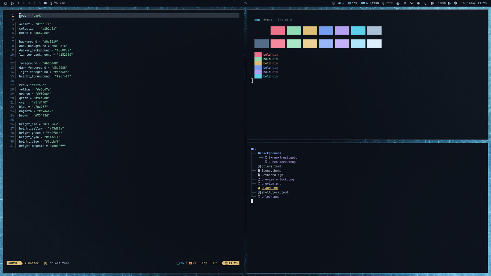
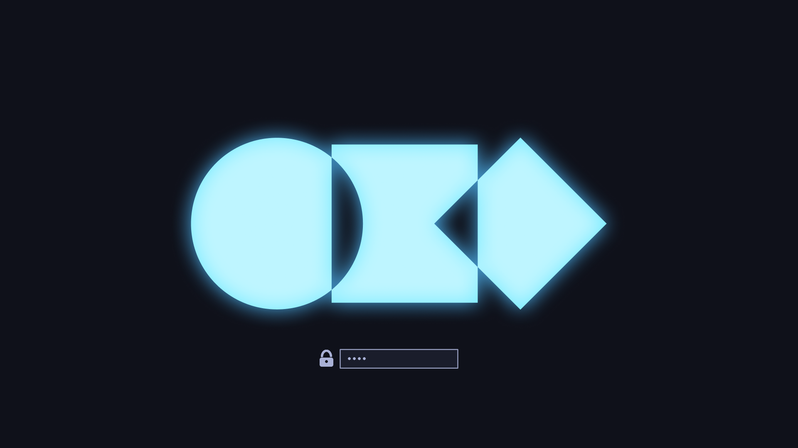

# Neo — Omarchy theme

A darker take on Omarchy's default Tokyo Night, with a teal accent and a frosted-ice wallpaper.



## Install

```bash
omarchy theme install https://github.com/Nejcc/omarchy-neo-theme
```

Switch back to it any time with `omarchy theme set neo`.

## Palette

| Role | Color | | Role | Color |
|---|---|---|---|---|
| Background | `#0f111a` | | Accent / cyan | `#2ac3de` |
| Dark background | `#0b0c13` | | Blue | `#7aa2f7` |
| Lighter background | `#1a1d2b` | | Magenta | `#bb9af7` |
| Selection | `#1f2335` | | Green | `#9ece6a` |
| Foreground | `#a9b1d6` | | Yellow | `#e0af68` |
| Bright foreground | `#c0caf5` | | Red | `#f7768e` |

The full palette is in [`colors.toml`](colors.toml). Omarchy generates the terminal, Hyprland, btop and other app configs from it.

## Wallpapers

- `0-neo-frost.webp`: frosted ice crystals around a clear dark center (the default)
- `1-neo-mark.webp`: a minimal "neo" wordmark

Cycle through them with `omarchy theme bg next`.

## Unlock screen



This theme includes a teal version of the Omarchy logo for the disk-unlock screen you see at boot. To use it, open **Omarchy menu → Style → Unlock** and pick Neo. This step needs sudo.

## Also themed

- Icons: `Yaru-prussiangreen`
- Keyboard backlight: `#2ac3de`
- Neovim and VS Code: the Tokyo Night colorschemes (`tokyonight-night` in Neovim, `enkia.tokyo-night` in VS Code)
